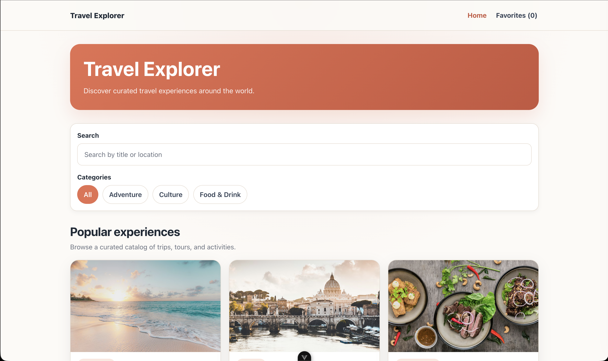

# Travel Explorer

Travel Explorer is a responsive single-page application built with Vue 3 and TypeScript for browsing curated travel experiences.

Users can search by keyword, filter by category, view detail pages, and save favorites with persistence through `localStorage`.

## Screenshot



## Live Demo

[View the live app](https://travel-explorer-tau.vercel.app/)

## Features

- Browse a curated catalog of travel experiences
- Search by title or location
- Filter by category
- View dynamic experience detail pages
- Save and remove favorites
- Persist favorites across page refreshes with `localStorage`
- Responsive layout for desktop and mobile

## Tech Stack

- Vue 3
- TypeScript
- Vite
- Vue Router
- Pinia
- CSS

## Motivation

I built this project to strengthen my Vue skills through a practical, product-focused exercise rather than a tutorial-only project.

The goal was to build a clean and complete SPA that demonstrates reusable components, reactive state, client-side routing, and persistent user interactions.

## Local Setup

```bash
npm install
npm run dev
```

## Production

```
npm run build
npm run preview
```

## What This Project Demonstrates

- reusable Vue components
- typed props and typed data models
- local state with ref and derived state with computed
- two-way binding with v-model
- route-based navigation with Vue Router
- shared state management with Pinia
- persistence with localStorage
- clean separation between views, components, state, and data

## Folder Structure

```
src/
  components/
  views/
  stores/
  data/
  router/
  types/
  assets/styles/
```

## Future Improvements

- Add a 404 page
- Replace mock data with a real API
- Add automated tests
- Expand the detail page with richer metadata
